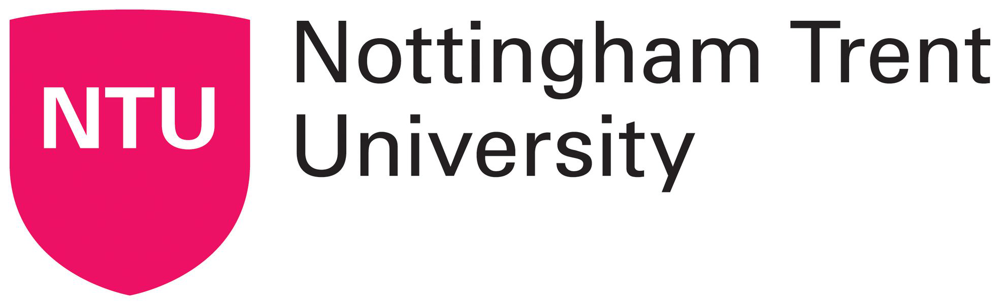

---
## Configure header of page

text_align_left: false
text_align_right: false
show_title_as_headline: false
headline: |
  Hi I'm Adrien!
---

<!-- this is a subheadline -->
Thanks for visiting my website :sunglasses:

I am from Mauritius Island, the [Lost Land of the Dodo](https://books.google.co.uk/books?hl=en&lr=&id=8xXSBAAAQBAJ&oi=fnd&pg=PA1&dq=lost+land+of+the+dodo&ots=UOSF_jJk8H&sig=QmdaYk6ZzFdb3wwQBqLKDJyWOSg&redir_esc=y#v=onepage&q=lost%20land%20of%20the%20dodo&f=false) :dodo:

In 2017, I graduated from the University of Reunion Island with a BSc in Life Sciences. Following this, I was awarded an Excellence Scholarship from the French Government to complete an MSc in Ecology, Biodiversity, and Evolution at Pierre and Marie Curie University (Sciences Sorbonne University) in Paris. I specialised in Conservation Sciences and graduated in 2019. During my studies and research internships at the National Museum of Natural History in Paris, I had the opportunity to acquire various knowledge in population dynamics/viability, biostatistics, GIS and R programming. 

In 2020 I decided to come back to my country and learn more about its endemic species. In my current job as Scientific Data Officer at the Mauritian Wildlife Foundation, I am responsible for the management and data analysis on our threatened endemic bird species: Mauritius Kestrel, Echo Parakeet, Pink Pigeon, Mauritius Fody, and Olive White-Eye. In this role, I also participate in fieldwork (predator control/monitoring), help in the development of monitoring methods and protocols, and I train staff in data entry and QGIS.

Since starting my Master’s degree, I have been very interested in population viability analysis, abundance indices, and population estimates. I was excited to learn about using capture-mark-recapture (CMR) models during my internships, where I worked on population viability and abundance trends concerning the common breeding bird survey (STOC) and on orchids. Now that I am working on data for the endemic bird species of my country, I am more and more interested in using and developing tools to monitor threatened species and to be able to produce more accurate population estimates. These tools are important to be able to detect early warning signs of population decline or atypical demographic rates when working on endangered/critically endangered species like in Mauritius.

I love using programming languages such as R to help NGOs with data analysis and their reproducibility. In 2021 my job at the Mauritian Wildlife Foundation consisted of rebuilding their entire data life cycle (from collection on field, the validation & compilation). For example, I have automated the production of population estimate graphs for five different endemic bird species, which will help to improve accuracy of graphs and reduce time spent in making them manually.
