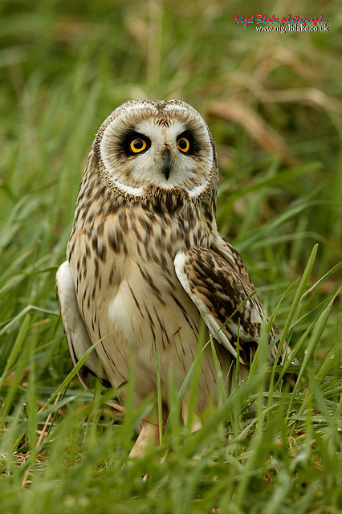

## Table of Contents
- [Introduction](#introduction)
- [The Arrival](#the-arrival)
- [The Team](#the-team)
- [The Avian Fauna](#the-avian-fauna)
- [The Experience](#the-experience)
- [Acknowledgment](#acknowledgment)
- [Final Thoughts](#final-thoughts)

## Introduction
Skomer Island is located off the Pembrokeshire coast of Wales, formed primarily of volcanic rock. Archaeological evidence indicates human settlements dating back to the Iron Age, though today it functions as a protected nature reserve managed by the [Wildlife Trust of South Wales](https://www.welshwildlife.org/). The island's geology—predominantly volcanic rock covered by thin, fertile soil—provides an optimal habitat for numerous species, particularly burrowing seabirds.

## The Arrival
We arrived on Skomer on April 26th, 2025, as weekly volunteers. Our boat departed from Martin's Haven on the mainland and landed at North Haven on Skomer Island. Weather conditions upon arrival included mist, which is relatively common in this maritime environment during spring.

*North Haven embarkation point*

*The team heading towards the farm on the first day*

*The farm (staff accommodation)*

## The Team
Our operational team consisted of six weekly volunteers, two long-term volunteers, and four staff members. Daily tasks were systematically assigned, including walks and talks with visitors around the island, observation point staffing at the Wick with spotting scopes to facilitate species identification, and logistical support during boat arrivals (landing, binoculars renting).

*The Wick viewpoint*

## The Avian Fauna
Skomer's ecological significance is particularly evident in its burrowing seabird populations. The island substrate is extensively tunneled, resembling a biological honeycomb structure. Two primary burrowing species inhabit these tunnels: approximately 150,000 pairs of [Manx Shearwaters](https://ebird.org/species/manshe) (*Puffinus puffinus*) and 43,000 [Atlantic Puffins](https://ebird.org/species/atlpuf) (*Fratercula arctica*).

The Manx Shearwaters return to their burrows at night, vocally active with their distinctive [calls](https://macaulaylibrary.org/asset/235543) . These vocalisations are characterised by a high-pitched, repetitive sound pattern that historically contributed to Skomer's ancient designation as the "island of lost souls." Overnight stays on Skomer provide valuable opportunities to observe these nocturnal avian activities, which are not accessible to day visitors.

Diurnal raptor species observable on the island include [Common Buzzard](https://ebird.org/species/combuz1?siteLanguage=en_GB#:~:text=Common%20Buzzard%20Buteo%20buteo&text=Commonest%20large%20hawk%20in%20many,especially%20moorland%20and%20rough%20grassland.) (*Buteo buteo*), [Common Kestrel](https://ebird.org/species/eurkes) (*Falco tinnunculus*), [Peregrine Falcon](https://ebird.org/species/perfal) (*Falco peregrinus*), and [Short-eared Owl](https://ebird.org/species/sheowl) (*Asio flammeus*). All avian observations (from any observers) were systematically recorded in the daily bird log at 8 pm. A comprehensive list of all the bird species that I identified is available in my [eBird trip report](https://ebird.org/tripreport/360210).

*Manx Shearwater (Puffinus puffinus) at the breeding grounds on Skomer Island ©Martin Reith*

*Atlantic Puffin (Fratercula arctica) cleaning his burrow, photographed at the Wick by ©Nigel Blake.*

*Atlantic Puffin (Fratercula arctica) photographed at the Wick by ©Nigel Blake.*

## The Experience
We were very lucky to have great weather during the week, with clear skies and temperatures reaching maximums of 25°C. The last days featured strong northerly winds, creating conditions unsuitable for boat landings. This resulted in a 24-hour extension of our stay, with a 48-hour period without any visitors (the island was ours!).

These days without visitors were an opportunity for infrastructure maintenance (painting, repairs & cleaning) and targeted monitoring. I participated in [Short-eared Owl](https://ebird.org/species/sheowl) (*Asio flammeus*) monitoring. During this survey, I got the amazing luck of seeing an individual flying just above my head, [calling](https://macaulaylibrary.org/asset/139759261) and showing territorial behaviors ("wing-clapping"). The nest was not very far...

*Short-eared Owl (Asio flammeus) photographed by ©Nigel Blake in April 2008*

## Acknowledgment
I would like to thank the entire team on the island: Ceris, Rob, Bob, Elana, Caroline & Becca.
A special acknowledgement to Dai who helped me significantly improve my species identification during the stay. It was a wonderful team and I strongly believe that the experience would not have been the same without you all.
Thank you [Nigel Blake](http://www.nigelblake.co.uk/) for the conversations and sharing amazing photos with me.

*The weekly volunteering team (Dai, Caroline, Becca, Bob, Me(Adrien), Elana)*

## Final Thoughts
I strongly encourage anyone who hasn't been to Skomer to visit the island, or to apply for volunteering. There is something very captivating and emotional about this island, and I feel like my simple human brain could only capture a small proportion of what was going on there... I hope to come back very soon. Goodbye (for now), Skomer.

*Skomer Island South coast*

*Sunset view from the North coast of Skomer Island*

