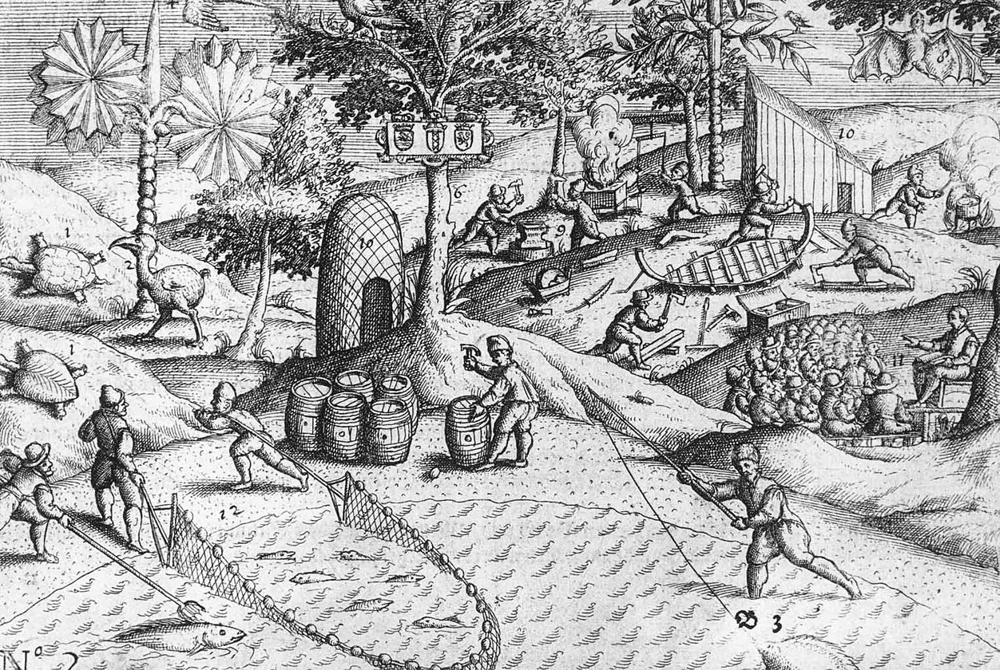
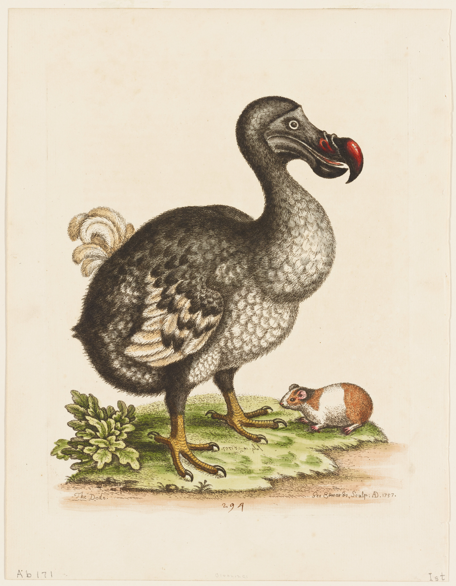
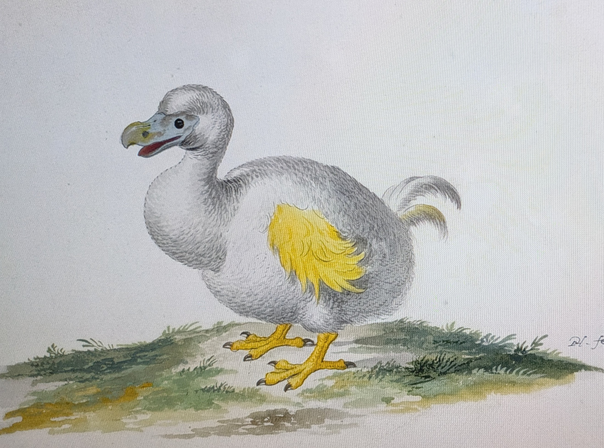

## Table of Contents
- [Introduction](#introduction)
- [Dead as a Dodo](#dead-as-a-dodo)
- [The Great Chain of Being](#the-great-chain-of-being)
- [The Dodo that never was...](#the-dodo-that-never-was)
- [References and further reading](#references)

## Introduction
When Dutch sailors first landed on Mauritius in 1598, they encountered a peculiar flightless bird unlike anything in Europe. The dodo (*Raphus cucullatus*) had evolved in isolation, a ground-dwelling pigeon that had lost its ability to fly in the absence of predators (clostest living relative being the [Nicobar pigeon](https://datazone.birdlife.org/species/factsheet/nicobar-pigeon-caloenas-nicobarica)). Within decades, this remarkable creature would vanish forever...

*Copper engraving of Dutch activity on Mauritius in 1598 from Het Tvveede Boeck (1601)*

## Dead as a Dodo
The dodo's extinction happened very rapidly, with the last sightings occurring between 1662 and 1680. This rapid decline and disappearance was driven by direct hunting and, more significantly, by the introduction of invasive species such as cats, dogs, pigs, and rats, which preyed on dodo nests and juveniles.

*The Dodo and the Guinea Pig, George Edwards (1757)*

## The Great Chain of Being
The dodo needed to wait a century and a half before its extinction being recognized.
In the days of naturalists like Cuvier and Buffon, the  concept of extinction was religiously wrong. 
If God had created all of nature according to a divine plan at the beginning, it would seem irrational for him to let some parts of that creation being wiped out. 
"The Great Chain of Being" (*scala naturae*): life was fundamentally perfect and unchangeable. In other words, the concept of "extinction" was considered impossible...Species might move to unexplored regions, but they could not simply cease to exist.
It was Georges Cuvier who, through meticulous comparative anatomy of elephants and mammoths fossils in the early 19th century, finally established extinction as scientific fact. Recognizing humanity's role in driving species to extinction.

## The Dodo that never was...
For over a century, scientists believed that a second species of dodo had lived on the nearby island of Réunion.

*Reunion white dodo (Raphus solitarus), watercolour drawing by Pieter Holsteyn II (1614-1687), undated.*

The confusion persisted for decades. This supposed "Réunion white dodo" was given various scientific names, including *Raphus solitarius*
Modern investigations by Arturo Valledor de Lozoya (2003) and Anthony Cheke and Julian Hume (2004) unraveled the mystery:
1. **The paintings described a Mauritian dodo**, not a Réunion species. Holsteyn's and Withoos's white dodo images were based on an earlier 1611 painting by Roelant Savery, which showed a whitish specimen from the Prague collection of Holy Roman Emperor Rudolf II. This was likely a pale or albino individual of the Mauritian dodo (*Raphus cucullatus*).

2. **The "solitaires" described historically were actually ibises**. Subfossil discoveries in the 1970s revealed that the large white birds early explorers encountered on Réunion were not dodos but rather a species of flightless ibis (*Threskiornis solitarius*), now called the Réunion ibis (no specimens were brought to Europe alive or dead). This ibis was indeed white and flightless, matching the travelers' descriptions, but it was an entirely different species.

3. **Dodos never reached Réunion**. Geological evidence shows that Mauritius is older than Réunion, and dodos had already become flightless before Réunion emerged from the sea. They could not have colonized the younger island.

## References and further reading

De Lozoya, A.V., 2003. An unnoticed painting of a white dodo. Journal of the History of Collections 15, 201–210. https://doi.org/10.1093/jhc/15.2.201

Hume, J.P., 2006. The history of the Dodo Raphus cucullatus and the penguin of Mauritius. Historical Biology 18, 69–93. https://doi.org/10.1080/08912960600639400

Hume, J.P., Cheke, A.S., 2004. The white dodo of Réunion Island: unravelling a scientific and historical myth. Archives of Natural History 31, 57–79. https://doi.org/10.3366/anh.2004.31.1.57

Mauremootoo, J., Cheke, A., Watt, I., 2015. Mauritius & Rodrigues Historical Context. https://doi.org/10.13140/RG.2.1.3372.6169

The dodo bird: The real facts about this icon of extinction | Natural History Museum [WWW Document], n.d. URL https://www.nhm.ac.uk/discover/the-dodo-bird-the-real-facts-about-this-icon-of-extinction.html (accessed 11.22.25).

Turvey, S.T., Cheke, A.S., 2008. Dead as a dodo: the fortuitous rise to fame of an extinction icon. Historical Biology 20, 149–163. https://doi.org/10.1080/08912960802376199
