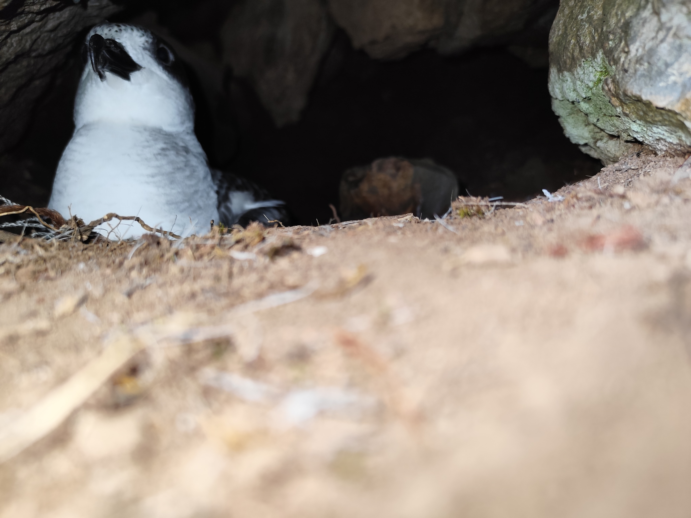
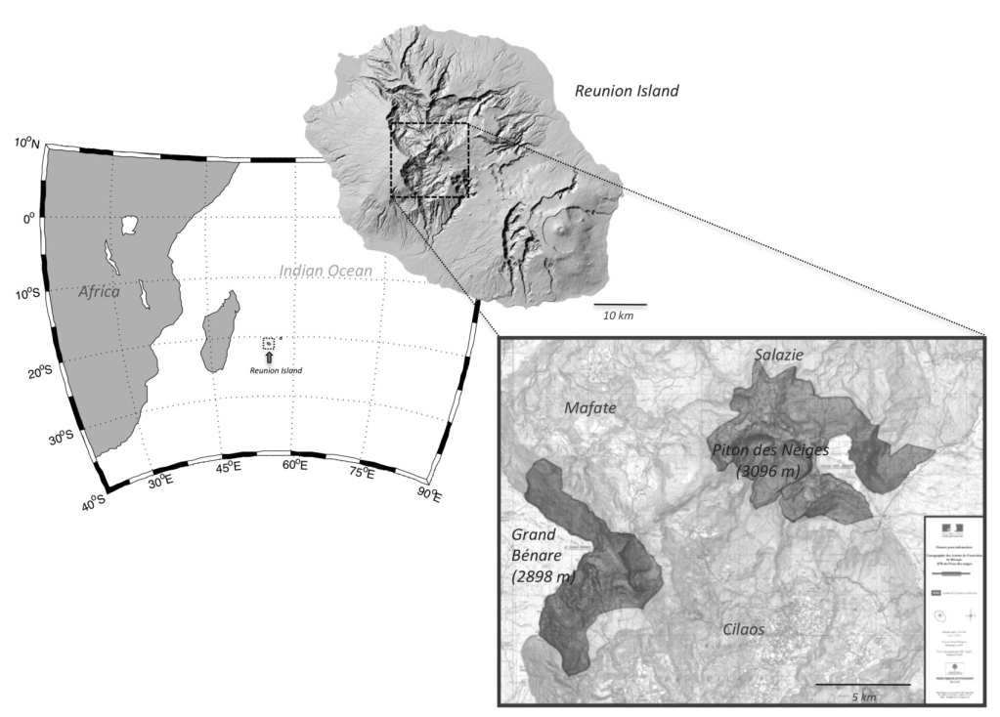
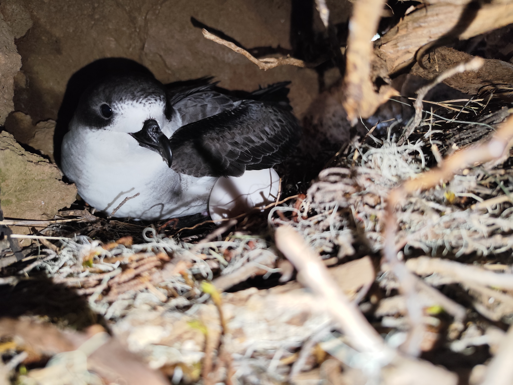

## Table of Contents
- [A Brief History](#a-brief-history)
- [Range and Endemism](#range-and-endemism)
- [Conservation Status and Threats](#conservation-status-and-threats)
- [Socio-Cultural Significance](#cocio-cultural-significance)
- [Conservation Efforts](#conservation-efforts)
- [References and further reading](#references-and-further-reading)

## A Brief History
The Barau’s Petrel was only formally described in 1964 by Christian Jouanin (Jouanin and Gill, 1967; Mayr, 1971), making it one of the most recently discovered seabird species, despite being well-known to local communities for centuries. Its name honors Armand Barau, a Réunion-born ornithologist and agricultural engineer who contributed significantly to the island’s natural history. 

*Nesting Cavity of Barau’s Petrel (Pterodroma baraui) in the Grand Bénare colony (©Merlène Saunier)*

## Range and Endemism
This species is strictly endemic to Réunion Island, nesting in remote, high-altitude colonies between 2,200 and 2,800 meters on volcanic massifs such as Piton des Neiges and Grand Bénare. These burrows, dug into soft volcanic soil, are among the most inaccessible seabird nesting sites in the world. After breeding, Barau Petrels migrate thousands of kilometers across the Indian Ocean, reaching areas near Madagascar, South Africa, and even the Ninety East Ridge, with only one nest found on Rodrigues Island at low altitude (Van Den Berg et al., 1991). 

*Approximate breeding distribution of Barau’s Petrel (Pterodroma baraui) on the two central massifs of Réunion Island, Piton des Neiges and Grand Bénare (Pinet et al., 2009)*

## Conservation Status and Threats
The IUCN lists Barau’s Petrel as Endangered, with an estimated population of 30,000–40,000 mature individuals and a declining trend (BirdLife International, 2018). Its survival is impacted by: 

1. **Light Pollution**: Fledglings mistake city lights for moonlight guiding them to the sea, leading to fatal grounding. Up to 40% of fledglings are affected each season. 
2. **Introduced Predators**: Feral cats and rats prey on eggs, chicks, and even adults. Modeling suggests extinction within 100 years without cat control (Pinet et al., 2009) 
3. **Habitat Modification**: Urban expansion and invasive plants threaten nesting areas.
4. **Climate Change**: Shifts in oceanic conditions may reduce suitable wintering habitats by 11% by 2100 (Legrand et al., 2016)

## Socio-Cultural Significance
Known locally as “*taille-vent*” or “*fouquet*,” the Barau Petrel is more than a bird - it’s a cultural emblem. Its eerie, plaintive cry once haunted Réunion’s nights, inspiring myths like that of “Grand-mère Kalle”, a legendary witch said to roam the mountains and manifest through the petrel’s calls. 

Today, the species symbolizes ecological pride. Community-led rescue campaigns, such as “Nuits sans lumière” (Lights-Off Nights), uniting schools, associations, and municipalities to save the species. These events have become powerful moments of environmental awareness, reinforcing the bond between people and nature.

## Conservation Efforts
The fight to save Barau’s Petrel is funded by the LIFE+ Pétrels program, a €3.1 million EU-funded initiative that brings together the Parc National de La Réunion, SEOR (Société d’Études Ornithologiques de La Réunion), and other partners. Actions include:

1. Predator control in breeding colonies.
2. Public awareness campaigns to reduce light pollution.
3. Scientific monitoring of nesting sites and migration routes. 

*Adult Barau’s Petrel (Pterodroma baraui) incubating egg in Grand Bénare colony (©Merlène Saunier)*

## References and further reading

BirdLife International, 2018. Species factsheet: Barau’s Petrel Pterodroma baraui [WWW Document]. BirdLife DataZone. URL https://datazone.birdlife.org/species/factsheet/baraus-petrel-pterodroma-baraui (accessed 11.24.25).

Grand-mère Kalle : la légende de la terrifiante sorcière Grand-mère Kalle : la légende de la terrifiante sorcière [WWW Document], n.d. . Île de la Réunion Tourisme. URL https://www.reunion.fr/decouvrez/histoires-et-fables/la-legende-de-grand-mere-kalle/ (accessed 11.24.25).

Jouanin, C., Gill, F.B., 1967. Recherche du pétrel de Barau Pterodroma baraui. Oiseau Rev Fr Ornithol 37, 1–19.

Le Pétrel de Barau | Parc national de la Réunion [WWW Document], n.d. URL https://www.reunion-parcnational.fr/fr/des-connaissances/la-faune/la-faune-indigene/le-petrel-de-barau (accessed 11.24.25).

Legrand, B., Benneveau, A., Jaeger, A., Pinet, P., Potin, G., Jaquemet, S., Le Corre, M., 2016. Current wintering habitat of an endemic seabird of Réunion Island, Barau’s petrel Pterodroma baraui, and predicted changes induced by global warming. Mar. Ecol. Prog. Ser. 550, 235–248. https://doi.org/10.3354/meps11710

Life + Pétrel | Parc national de la Réunion [WWW Document], n.d. URL https://www.reunion-parcnational.fr/fr/des-actions/proteger-et-gerer/les-projets-de-conservation/life-petrel (accessed 11.24.25).

LIFE 3.0 - LIFE Project Public Page [WWW Document], n.d. URL https://webgate.ec.europa.eu/life/publicWebsite/project/LIFE13-BIO-FR-000075/halting-the-decline-of-endemic-petrels-from-reunion-island-demonstration-of-large-scale-innovative-conservation-actions (accessed 11.24.25).

Mayr, E., 1971. New species of birds described from 1956 to 1965. Journal für Ornithologie.

Nuits sans lumière 2025 : campagne de sauvetage des Pétrel de Barau | Mairie de Saint-Pierre [WWW Document], n.d. URL https://www.saintpierre.re/tous/nuits-sans-lumiere-2025-campagne-de-sauvetage-des-petrel-de-barau (accessed 11.24.25).

Pinet, P., Salamolard, M., Probst, J.-M., Russell, J.C., Jaquemet, S., Corre, M.L., 2009. Barau’s petrel (Pterodroma baraui): history, biology and conservation of an endangered endemic petrel.

Van Den Berg, A.B., Smeenk, C., Bosman, C.A.W., Haase, B.J.M., Van Der Niet, A.M., Cadée, G.C., 1991. Barau’s Petrel Pterodroma baraui, Jouanin’s Petrel Bulweria fallax and other seabirds in the northern Indian Ocean in June–July 1984 and 1985. Ardea 79, 1–14.
