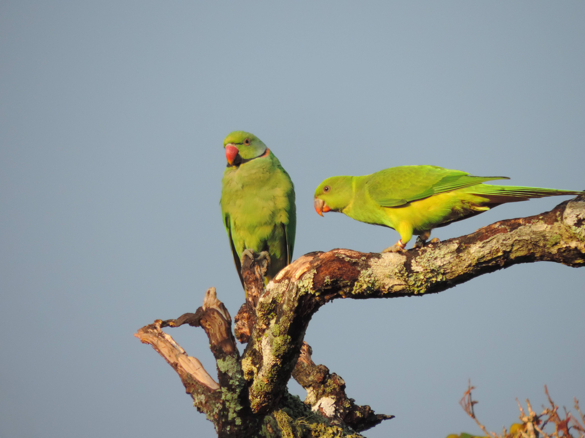
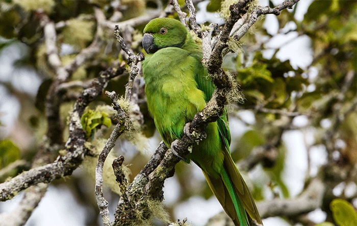
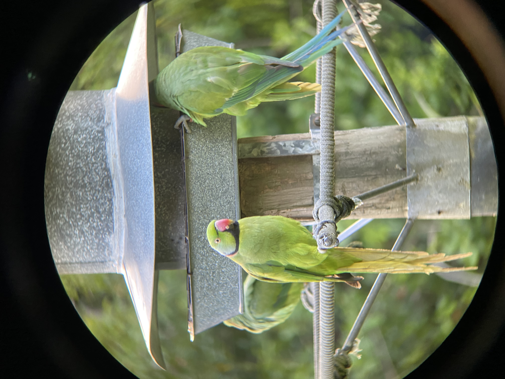

    
    <figcaption style="margin-top: 10px;">Male Echo parakeet with juvenile (© Vanousha Pillay)</figcaption>

The Mauritius or ‘echo’ parakeet (*Alexandrinus eques*) is perhaps the most acutely studied bird in Mauritius and maybe one of the most studied in the world. Due to human settlement and expansion since the 17th century, which led to habitat loss and fragmentation (Cheke and Hume, 2020; Safford, 1997; Vaughan and Wiehe, 1937), as well as the introduction of exotic plants and animals (Lorence and Sussman, 1986), two endemic species of parrot went extinct ([*Lophopsittacus mauritianus*](https://datazone.birdlife.org/species/factsheet/broad-billed-parrot-lophopsittacus-mauritianus) and [*Lophopsittacus bensoni*](https://datazone.birdlife.org/species/factsheet/mauritius-grey-parrot-lophopsittacus-bensoni) (Cheke, 1987)) and the Echo Parakeet population size and range began to decline (Jones, 1980). By the 1980s, this decline had progressed to the point where the species was classified as 'critically endangered' on the IUCN Red List. The extinction of the species seemed imminent by the early 1990s, when the echo parakeet was considered not only the rarest parrot in the world (Venning, 1993), but also one of the world's rarest and most endangered bird of any group (Collar et al., 1994). However, intensive conservation efforts helped the species to recover from a population size of fewer than 20 individuals in the 1980s (Jones 1987, Jones and Duffy 1993) to over 150 breeding pairs and 800 individuals in 2020 (MWF, 2020). As a result, the species was downlisted on the IUCN Red List twice this century, from Critically Endangered to Endangered in 2007 (BirdLife International, 2007), and to Vulnerable in 2019 (BirdLife International, 2019).

> "Like most Mauritian naturalists I believe that the echo parakeet will become extinct in the very near future." (Jones, 1980)

  
  
  <figcaption>Female Echo parakeet (© Jacques de Speville)</figcaption>

The conservation success of the echo parakeet was achieved through intensive conservation 
management (including captive breeding, nest manipulation, installation of artificial nest boxes, 
supplementary food, predator and competitor control) and monitoring (Jones and Duffy, 1993; Thorsen 
and Jones, 1998). Population recovery is largely due to the provision of artificial nest boxes (Tatayah et al., 2007) and
supplemental food (Tollington et al., 2018).

  
  
  <figcaption>Echo parakeets at feeding station (© Rebecca Louch)</figcaption>

## Facts

* The only survivor of six parrot species once found in the Mascarenes islands.
* Diet: leaves, fruits, flowers and stems of primarily native plant species (also includes exotic species).
* Cavity nesters (naturally nesting in cavities in endemic trees).
* The Echo Parakeet project is the world’s most successful parrot recovery programme.

More information about the project on [Mauritian Wildlife Foundation](https://www.mauritian-wildlife.org/projects/ "Mauritian Wildlife Foundation website").
