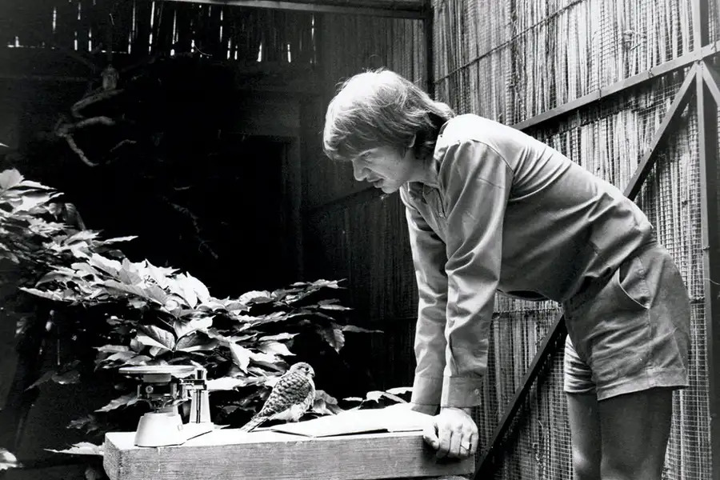

The Mauritius Kestrel (*Falco punctatus*) is a small bird of prey endemic to the island of Mauritius. Once abundant throughout the island, the population of Mauritius Kestrels began to decline rapidly in the 20th century due to a combination of factors, primarily habitat loss, introduced predators, and the widespread use of pesticides like [DDT](https://www.cdc.gov/biomonitoring/DDT_FactSheet.html#:~:text=Dichlorodiphenyltrichloroethane%20(DDT)%20is%20an%20insecticide,of%20mosquitoes%20that%20spread%20malaria.)

By the 1970s, the Mauritius Kestrel had become one of the rarest birds in the world, with only a handful of individuals remaining in the wild. At its lowest point in 1974 it was estimated that there were only four individuals left.

However, the story of the Mauritius Kestrel took a remarkable turn thanks to the efforts of conservationists. In 1973, the [Durrell Wildlife Conservation Trust](https://www.durrell.org/), led by conservationist Gerald Durrell, launched a captive breeding program for the Mauritius Kestrel in collaboration with the Mauritian government and other conservation organizations.

Despite initial challenges and setbacks, including difficulties in breeding the birds in captivity and concerns about inbreeding, the breeding program eventually began to yield results. Through careful management and dedication, the population of Mauritius Kestrels in captivity began to increase steadily.

In 1987, the first captive-bred Mauritius Kestrels were released back into the wild, marking a major milestone in the species' conservation. Over the following years, additional releases were conducted, and supplementary feeding programs were implemented to support the reintroduced birds as they adjusted to their natural habitat.

  
  <figcaption>Carl Jones in 1982 with one of the first Mauritius kestrels that hatched in captivity</figcaption>

The efforts to save the Mauritius Kestrel paid off, and the population began to rebound. By the early 2000s, the population had increased to over 400 individuals, with breeding populations established in various parts of the island.

Today, the Mauritius Kestrel stands as a symbol of successful conservation efforts and serves as a reminder of the importance of protecting endangered species and their habitats. While challenges remain, particularly in addressing ongoing threats such as habitat destruction and invasive species, the recovery of the Mauritius Kestrel is a proof of what can be achieved through dedication, collaboration, and innovation in conservation efforts.

  
  <figcaption>Holding a juvenile Mauritius kestrel from the 2020-21 breeding season</figcaption>

## Facts

* fact 1
* fact 2
* fact 3
* fact 4
